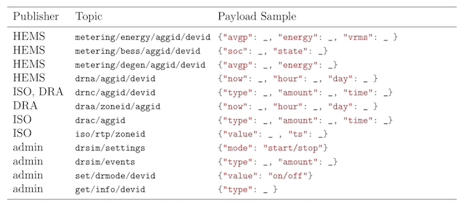
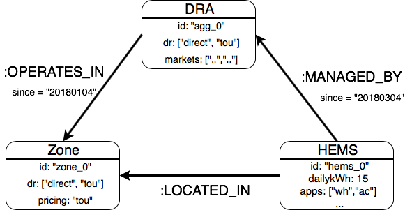
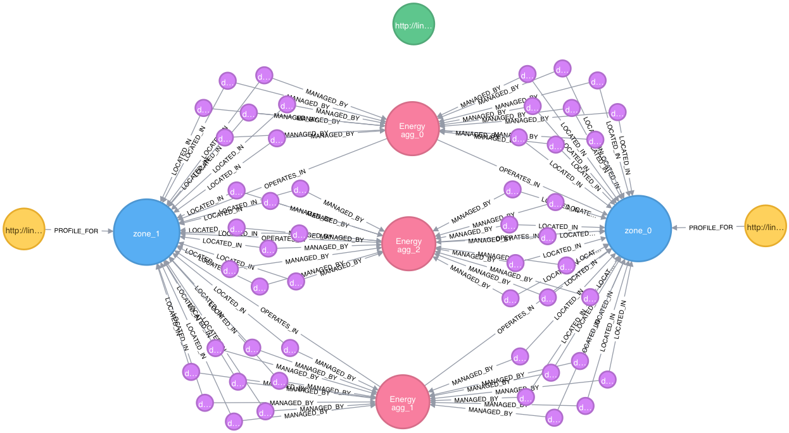
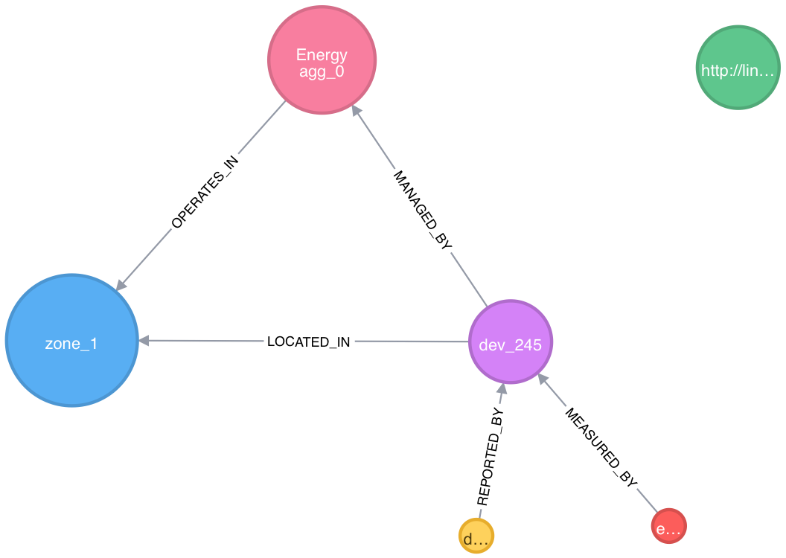
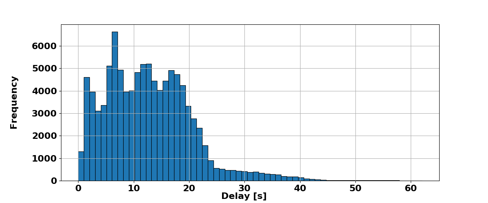

#### M.S. Thesis Defense
## A Multi-Agent Simulation Tool for the Modern Grid

#### Holm Smidt
---

#### Digitalization

+++

#### Machine Learning

+++

#### What about the energy grid?

+++

#### The status quo is what we know well.

+++

#### How do we do what's new?

 @size[0.5em](HECO Grid Modernization Plan)

---

#### We can @size[1.3em](@color[orange](design models)) and run @size[1.3em](@color[orange](simulations))

+++

#### Objectives:

Develop and test a multi-agent simulation tool that
@ul

- models @color[green](agent-level behavior) and packages it as easy-to-deploy applications;
- enables lighweight @color[orange](communication) among (virtually) resource constrained devices;
- provides @color[red](administrative) monitoring, control, and management

@ulend

+++

#### System Architecture - Overview

@size[0.7em](System services structured into the three implementation layers)

+++

#### Presentation Outline

@ol

- What are agents and how to model them.
- Sharing data among the right nodes.
- Using graph databases to keep track of agents and their relationships.
- Bringing everything together with the web application.
- Simulation outcomes.

@olend

---

## Agent Models
#### Agent Layer

+++

#### What defines an agent?

@size[0.7em](NIST Smart Grid Domains)

+++

#### Use Case: Residential Demand Management & Response

The @color[orange](simulation goal) is to model residential energy usage based on individual appliances and then control the appliances in the case of a @color[orange](direct load control) (DLC) event.

+++

#### House application

@ul
- Python application
- Runs in real-time
- Publishes @color[orange](energy usage) and @color[orange](demand response availability) every 5 minutes
- Subscribes to @color[orange]control settings
- @color[green](Turns appliances on/off) based on a predefined schedule
- @color[green](Controls the temperature) of the house

@ulend

+++

<table>
  <tr>
    <th>Appliance</th>
    <th>Controls</th>
    <th>Power</th>
    <th>Schedule </th>
  </tr>
  <tr>
    <td>Lights</td>
    <td>fixed</td>
    <td>360 W</td>
    <td>5-8am, 6-11pm</td>
  </tr>
  <tr class="fragment">
    <td>Refrigerator</td>
    <td>fixed</td>
    <td>200 W</td>
    <td>12-1am, 5-6am, 8-9am, 11- 12pm, 3-4pm, 7-8pm </td>
  </tr>
  <tr class="fragment">
    <td>Entertainment (TV)</td>
    <td>fixed</td>
    <td>200 W</td>
    <td>5-10pm</td>
  </tr>
  <tr class="fragment">
    <td>Range/Oven</td>
    <td>fixed </td>
    <td>3500 W</td>
    <td>11-12pm, 6-7pm</td>
  </tr>
  <tr class="fragment">
    <td>HVAC</td>
    <td>variable </td>
    <td>3500 W</td>
    <td>12am-3am, 10-2pm, 5-11pm</td>
  </tr>
  <tr class="fragment">
    <td>Baseload</td>
    <td>fixed schedule </td>
    <td>250 W$^*$ </td>
    <td>N/A</td>
  </tr>
</table>

+++

#### Thermal model
`\[
\frac{dT}{dt} = \frac{-1}{C_{H}} \left( P_{HVAC} + \frac{T_H - T_a}{R_{TH}}\right)
\]`  
`\[
T_{H_i} = T_{H_{i-1}} - \frac{1}{ R_{TH} C_{H}} \int_{t_{i-1}}^{t_i} \left( R_{TH}P_{HVAC} + (T_{H_{i-1}} - T_a)\right) d\tau
\]`

+++

#### PI Controls

- control the HVAC output when the system is running

`\[
 c(t) = K_p  e(t) + K_i  \int_0^t e(\tau) d\tau
\]`

+++

---

## Publish/Subscribe Messaging
#### Communication Layer

+++

## Publish / Subscribe Concept

+++

## MQTT API Design

+++

#### Assume the following scenario:
@ul
- A home with `devid='dev_34'` is assigned to a DRA with `aggid='agg_1'`.
- The home is reporting an availability of 1 kW of load to shed by publishing to the `drna/agg_1/dev_34` topic
- The home is subscribed to the `set/drmode/dev_34` and `drnc/agg_1/dev_34` topics
- The iso is subscibed to the `drsim/events` topic
@ulend
+++

#### In the case of a DLC event:
@ul
- The user chooses to curtail 100 kW of load immediately, which the web application therefore publishes to `drsim/events` with a payload of `{"type": "DLC", "amount": 100, "minutes": 10}`
- The iso receives this, and publishes `{"type": "DLC", "amount": 1, "minutes": 10}` to the `drnc/agg_1/dev_34` topic
- The home receives this, sheds its load, and at the next time interval reports zero availability.
@ulend
+++

---

## Graph Databases for System Modelling
#### Administration Layer

+++

#### Cyber-Physical System Modeling

+++

#### Implementation

+++

+++

---

## Web Application For Administration
#### Administration Layer
Demo
---

## Simulation Platform Evaluation
#### Results

+++

#### Data processing delay

- delay between the sending of a massage and its insert in the DB
- a sample of 100,000 sample showed

<table>
  <tr>
    <th>Parameter</th>
    <th>Value</th>
  </tr>
  <tr>
    <td>Mean</td>
    <td>12.7</td>
  </tr>
  <tr>
    <td>Median</td>
    <td>12.0</td>
  </tr>
  <tr>
    <td>Std. Dev.</td>
    <td>7.9</td>
  </tr>
  <tr>
    <td>Min</td>
    <td>0.57</td>
  </tr>
  <tr>
    <td>Max</td>
    <td>62</td>
  </tr>
</table>

+++

+++

## Power and Price Input

+++

## Power Output (Device Level)

+++

## Energy Output (Aggregate Level)

+++

## Variable Pricing Output (Aggregate Level)

---

## Conclusion

---

# Big Mahalo
