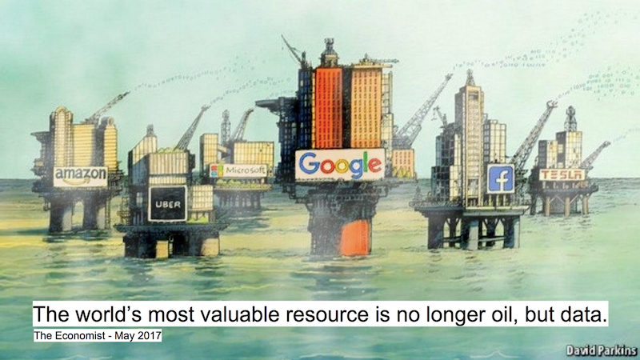
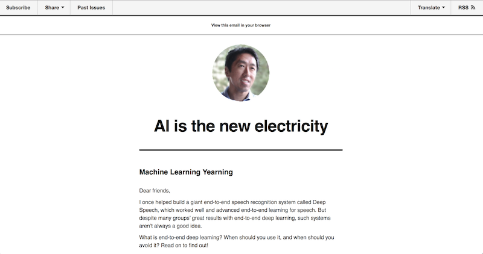
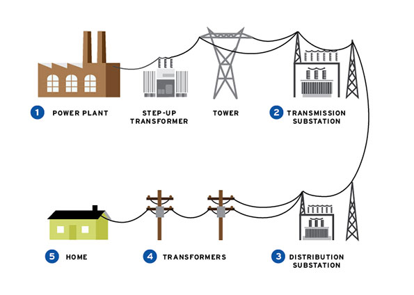
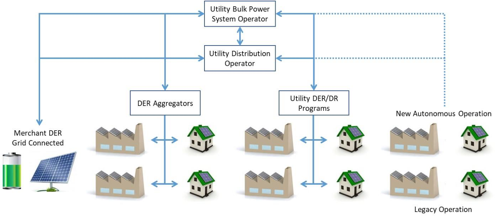
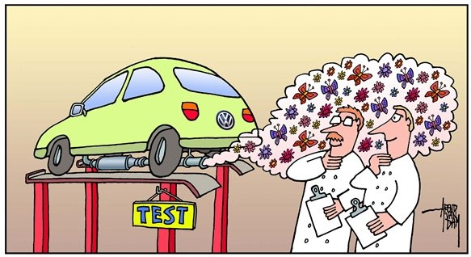
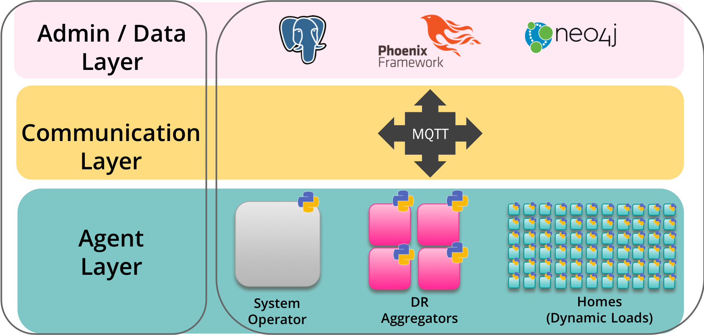
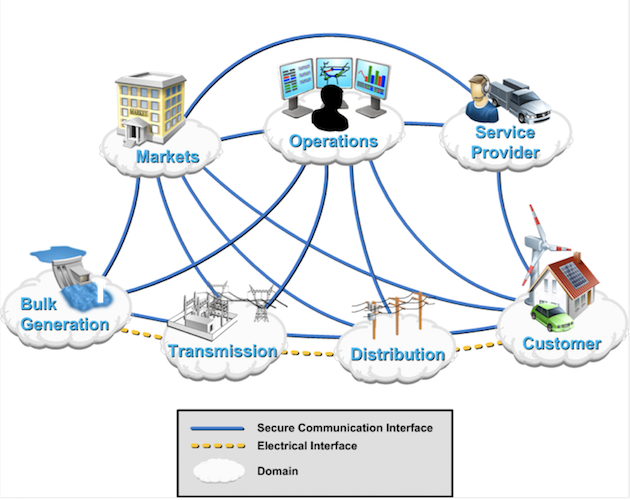
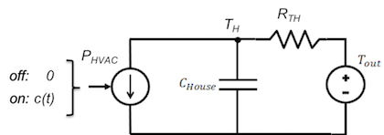

#### M.S. Thesis Defense
## A Multi-Agent Simulation Tool for the Modern Grid

#### Holm Smidt
---

| Digitalization |
|:---:|

+++

| Machine Learning |
|:---:|

+++

#### What about the energy grid?

+++

| The status quo is what we know well. |
|:---:|

+++

| How do we do what's new? |
|:---:|

 @size[0.5em](HECO Grid Modernization Plan)

---

| We can @size[1.3em](@color[orange](design models)) and run @size[1.3em](@color[orange](simulations)) |
|:---:|

+++

#### Objectives:

Develop and test a multi-agent simulation tool that
@ul

- models @color[green](agent-level behavior) and packages it as easy-to-deploy applications;
- enables lighweight @color[orange](communication) among (virtually) resource constrained devices;
- provides @color[red](administrative) monitoring, control, and management

@ulend

+++

| System Architecture - Overview |
|:---:|

@size[0.7em](System services structured into the three implementation layers)

+++

#### Presentation Outline

@ol

- What are agents and how to model them.
- Sharing data among the right nodes.
- Using graph databases to keep track of agents and their relationships.
- Bringing everything together with the web application.
- Simulation outcomes.

@olend

---

## Agent Models
#### Agent Layer

+++

| What defines an agent? |
|:---:|

@size[0.7em](NIST Smart Grid Domains)

+++

| Use Case: Residential Demand Management & Response |
|:---:|

The @color[orange](simulation goal) is to model residential energy usage based on individual appliances and then control the appliances in the case of a @color[orange](direct load control (DLC) event).

+++

#### House application

@ul
- Python application
- Runs in real-time
- Publishes @color[orange](energy usage) and @color[orange](demand response availability) every 5 minutes
- Subscribes to control settings
- Turns appliances on/off based on a predefined schedule
- Controls the temperature of the house 
@endul

+++

<table>
  <tr>
    <th>Appliance</th>
    <th>Controls</th>
    <th>Power</th>
    <th>Schedule </th>
  </tr>
  <tr>
    <td>Lights</td>
    <td>fixed</td>
    <td>360 W</td>
    <td>5-8am, 6-11pm</td>
  </tr>
  <tr class="fragment">
    <td>Refrigerator</td>
    <td>fixed</td>
    <td>200 W</td>
    <td>12-1am, 5-6am, 8-9am, 11- 12pm, 3-4pm, 7-8pm </td>
  </tr>
  <tr class="fragment">
    <td>Entertainment (TV)</td>
    <td>fixed</td>
    <td>200 W</td>
    <td>5-10pm</td>
  </tr>
  <tr class="fragment">
    <td>Range/Oven</td>
    <td>fixed </td>
    <td>3500 W</td>
    <td>11-12pm, 6-7pm</td>
  </tr>
  <tr class="fragment">
    <td>HVAC</td>
    <td>variable </td>
    <td>3500 W</td>
    <td>12am-3am, 10-2pm, 5-11pm</td>
  </tr>
  <tr class="fragment">
    <td>Baseload</td>
    <td>fixed schedule </td>
    <td>250 W$^*$ </td>
    <td>N/A</td>
  </tr>
</table>

+++

#### Thermal model
`\[
\frac{dT}{dt} = \frac{-1}{C_{H}} \left( P_{HVAC} + \frac{T_H - T_a}{R_{TH}}\right)
\]`  
`\[
T_{H_i} = T_{H_{i-1}} - \frac{1}{ R_{TH} C_{H}} \int_{t_{i-1}}^{t_i} \left( R_{TH}P_{HVAC} + (T_{H_{i-1}} - T_a)\right) d\tau
\]`

+++

#### PI Controls

- control the HVAC output when the system is running

`\[
 c(t) = K_p  e(t) + K_i  \int_0^t e(\tau) d\tau
\]`

---

## Publish/Subscribe Messaging
#### Communication Layer

---

## Graph Databases for System Modelling
#### Administration Layer

---

## Web Application For Administration
#### Administration Layer

---

## Simulation Platform Evaluation
#### Results

---

## Use Case

Using a LEZETi Hybrid Solar PV Mini Split Air Conditioner for Produce Cooling

+++

|   |  |
|:---:|:---:|
| Container Top View | Indoor Ducted Units |

+++

|   |  |
|:---:|:---:|
| Outdoor Unit | Control Unit |

+++

|  |
|:---:|
|Schematic view of dynamic system |

---

## Controller Design

_Objective:_ Find control gains Kp, Ki, and Kd that best control the system.

_Desired properties:_ Stability, low error, low energy usage.

_Proposed Method:_ Genetic search algorithm.

+++

## Background

* PID controller is the most common controller in the industry
* Can be tuned by hand or computer software (if dynamics are known); difficult when system dynamics are unknown, when there are time delays, and when there are changes in the environment, etc.

+++

## Background

* Numerous works on PID controller tuning using EV: genetic search, particle swarm optimization, differential evolution, ...
* Most works simply consider simulations

+++

## Challenges

How to interface with the system?

How to overcome time constraints?   (One passive heating & active cooling cycle takes about 20-30 minutes.)

+++

## Approach

IoT system design to communicate with learning agents over the network.

Network multiple learning agents.

Store environmental and control parameters of each agent in a Graph Database.

---

## Genetic Search Algorithm

#### Design

+++

|   |  |
|:---:|:---:|
| Main Loop | Fitness Evaluation |

+++

## Fitness Function

|  |
|:---:|
|  |
| Fitness Function J, Integrated Absolute Error IAE, and consumed Energy E |

+++

## Graph Database

|  |
|:---:|
| Graph representation in neo4j |

---

## Initial Implementation

+++

## Parameters

|   |  |
|:---:|:---:|
| GA parameters | Setpoint sequence |

+++

## Initial Results

|  |
|:---:|
| Sample run analysis, promising observations did not lead to satisfactory convergence |

---

## Conclusions

+++

## So far ...

* Infrastructure for genetic search over the network and across agents is in place
* Promising components: constructive selection, graph query
* Initial tests run with gained insights but little success

+++

## What's next ...

- Add **virtual nodes** to the graph database and update them through simulations
- Add actual learning agents
- Revisit **fitness function, mutation, and selection**
